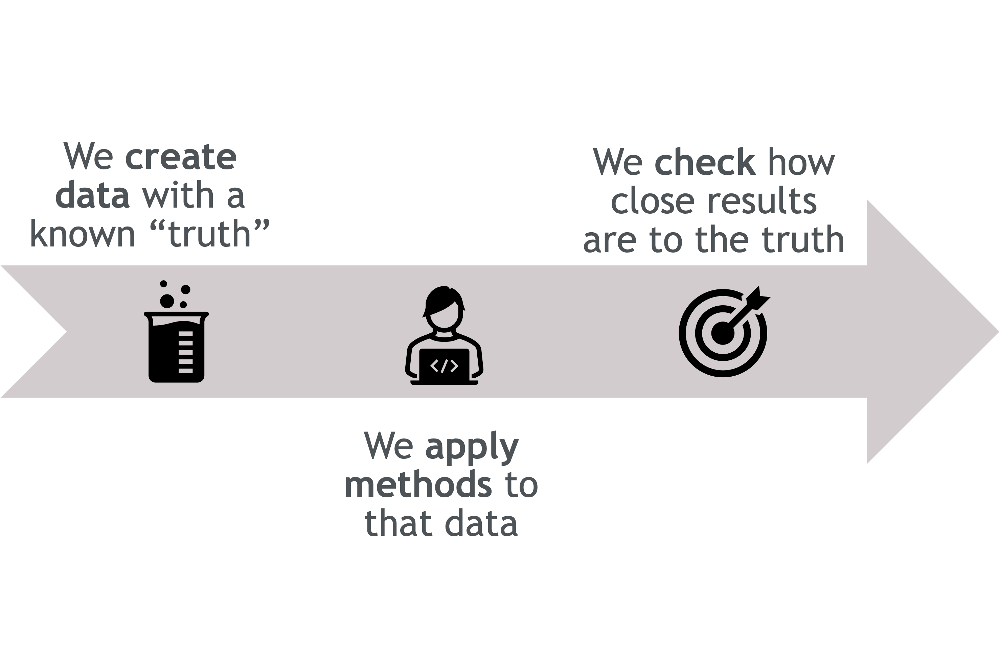
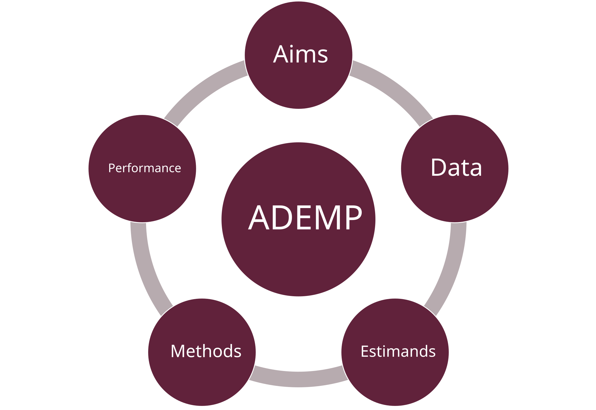
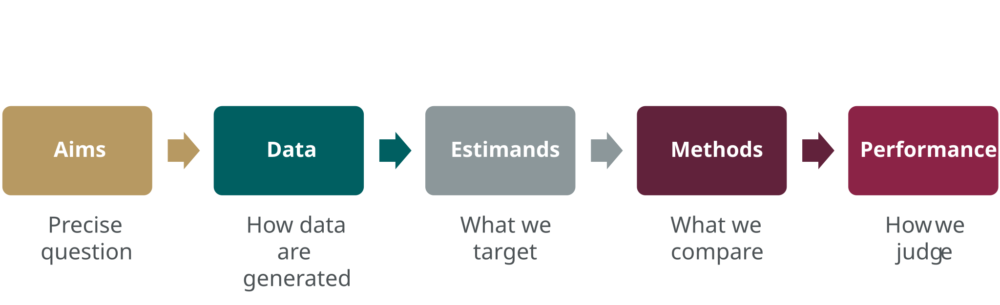
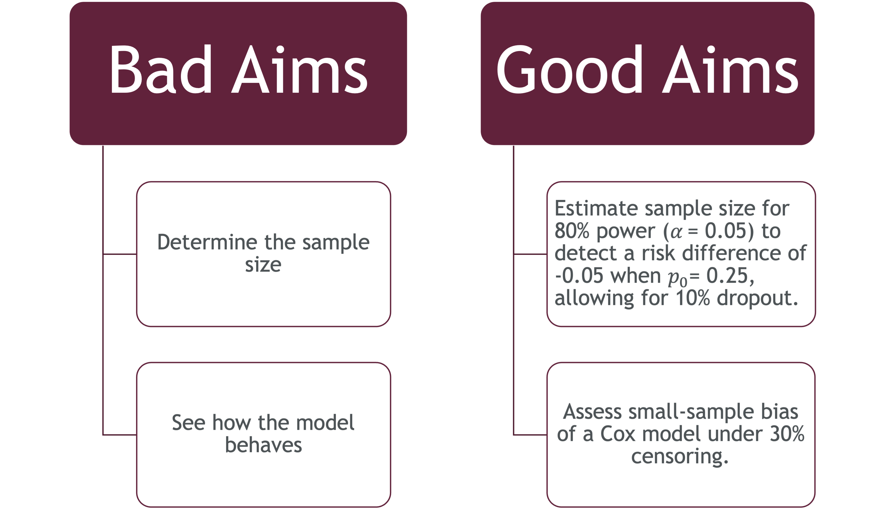
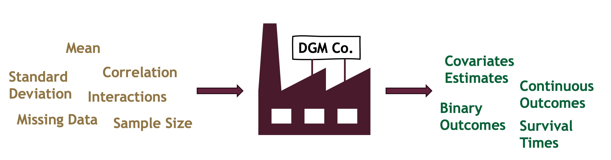
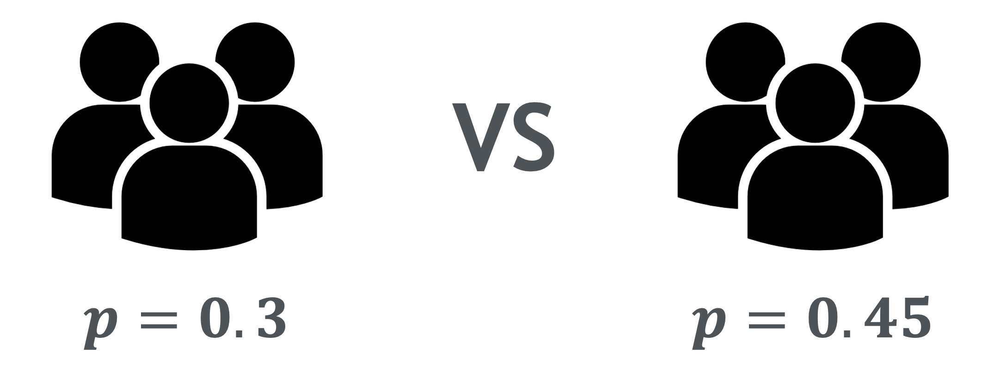
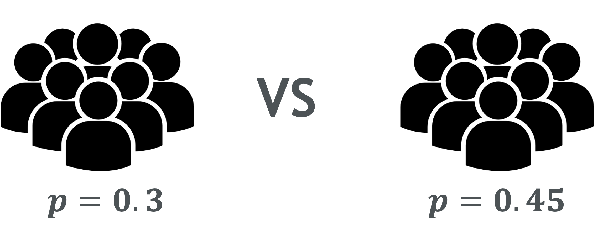
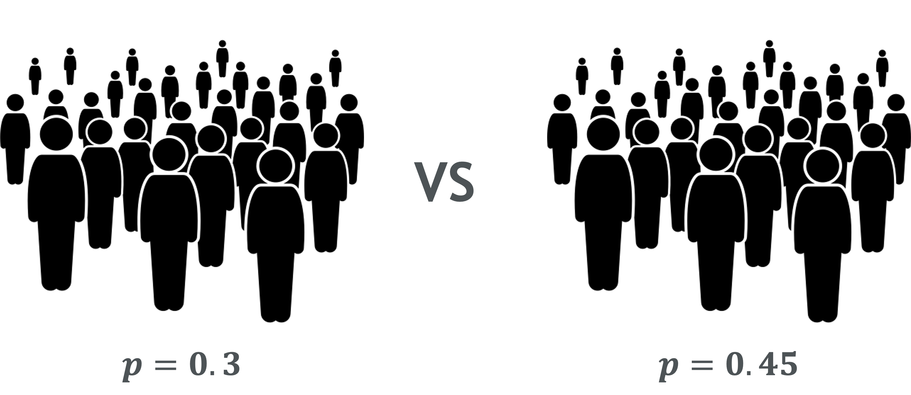

```{r}
#| label: setup
#| include: false

# Load required libraries
library(tidyverse)
library(knitr)
library(kableExtra)
library(DT)
library(plotly)
library(patchwork)
library(broom)
library(furrr)
library(progressr)
library(gt)
library(DT)

# Set global options
options(
  scipen = 999,
  digits = 3,
  knitr.kable.NA = ''
)

# Set theme for ggplot2
theme_set(
  theme_minimal(base_size = 14) +
    theme(
      plot.title = element_text(face = "bold", hjust = 0.5),
      plot.subtitle = element_text(hjust = 0.5),
      legend.position = "bottom",
      panel.grid.minor = element_blank()
    )
)

# Custom color palette
ademp_colors <- c(
  "primary" = "#2C3E50",
  "secondary" = "#3498DB", 
  "success" = "#27AE60",
  "warning" = "#F39C12",
  "danger" = "#E74C3C",
  "info" = "#16A085"
)

# Set seed for reproducibility
set.seed(20251017)

# Source helper functions (safe if missing)
if (file.exists("R/simulation_helpers.R")) source("R/simulation_helpers.R")
if (file.exists("R/visualization_helpers.R")) source("R/visualization_helpers.R")
```

# Aim & Objectives {#aim-objectives-title auto-animate="false"}

## Aim & Objectives {#aim-objectives}

**Aim**

Equip you to design, run, and report transparent simulation studies using ADEMP

<br>

**By the end, you will:**

1.  **Explain** each ADEMP component
2.  **Specify** realistic data mechanisms
3.  **Build** power simulations in R
4.  **Report** with Monte Carlo SEs
5.  **Avoid** common pitfalls

::: notes
This seminar takes a hands-on approach to simulation studies in biostatistics. By the end, you won't just understand the theory—you'll have the practical skills to design and implement your own simulations. The ADEMP framework gives us a structured workflow that prevents common mistakes and ensures our simulations actually answer the questions we care about.
:::

# But what *is* a simulation study? {#what-is-sim-title}

## Simulation study = a **virtual experiment on data** {#what-is-sim incremental=true}

{fig-align="center" width="80%"}

::: notes
A simulation study is essentially a controlled experiment where we know the truth from the start. Think of it as three key steps:

1. We create data where we control the parameters—we set the true effect size, sample size, variability, etc.
2. We apply methods to that data—the same statistical methods we'd use in practice (regression, tests, estimation techniques).
3. We evaluate performance** by comparing results against the known truth—measuring bias, coverage, power, and other metrics.

This gives us complete transparency: we can see exactly when methods work well, when they start to break down, and under what conditions they fail entirely.
:::

# Why simulate? {#why-sim-title}

## Why simulate? {#why-sim incremental=true}

::: columns
::: {.column width="55%" .fragment}
- When **formulas fail**, simulate
- Real data are **messy** (missingness, nonlinearity, clustering)
- **Assumptions break** in practice
- We need to test “**what if**” scenarios safely
- Simulations reveal if methods are **robust**, **unbiased**, and **reliable**
:::

::: {.column width="45%"}
{width="80%" .fragment fig-align="center"}
:::
:::

::: notes
We simulate to “rehearse” real-world messiness. It’s a safe sandbox to see if a method holds up with missing data, small samples, or nonlinearity—before we bet a study’s conclusions on it.
:::

# Enter ADEMP! {#ademp-title}

## ADEMP Overview {#ademp-overview}

::: {.r-stack}

::: {.fragment .fade-in-then-out fragment-index=1}
:::{.content-visible when-format="html"}
{fig-align="center" width="60%"}
:::

:::{.content-visible when-format="pdf"}
*Figure available in HTML version.*
:::
:::

::: {.fragment .fade-in fragment-index=2}
:::{.content-visible when-format="html"}
{fig-align="center" width="80%"}
:::

:::{.content-visible when-format="pdf"}
*Figure available in HTML version.*
:::

::: incremental
1.  Start with **Aims**;
2.  Design the **Data-generating mechanisms**;
3.  **Estimands** are determined by the DGM.
4.  Select **Methods** to estimate those Estimands;
5.  Evaluate with **Performance** measures chosen to serve the Aims.
:::
:::

:::

::: notes
ADEMP is a simple order of operations. Each step builds on the previous. Aims drive everything - they determine what data to generate and what to estimate. Methods must actually answer your estimand, and performance measures must align with your aims.
:::

# Aims {#aims-title}

## **A** : Aims {#aims}

The aims define **what the simulation study seeks to learn** about a method’s statistical properties.

. . .

{fig-align="center" width="80%"}

::: notes
The Aim sets the compass. Are we stress-testing methods under realistic conditions, or just showing proof of concept? Clear aims avoid a common mistake: running simulations first and deciding later what they were for.
:::

## **A** : Aims {#aims-example}

{fig-align="center" width="80%"}

::: notes
Notice how the aims on the right are specific and testable. They ask focused statements about method performance under defined conditions. Good aims aren't just "compare Method A and B"; they specify what aspect matters (bias? power? coverage?) and under what realistic scenarios. This specificity guides every downstream decision in the ADEMP workflow.
:::

# Data-generating Mechanisms {#dgm-title}

## **D** : Data-generating Mechanisms {#data-mechanisms}

::: notes
The DGM is your virtual factory. It takes in certain parameters of interest as components and builds them into the outcome you wish to simulate

It’s where you decide what world your methods will live in — how realistic, how messy, how extreme they are. The more thoughtful your DGM, the more meaningful your conclusions.

If I want to test survival models, my DGM might simulate event times from a log-logistic distribution with right-censoring. I can vary the sample size or censoring rate to see how the method performs across contexts.

Parametric DGMs give you control and flexibility—you can systematically vary sample sizes, effect sizes, and distributions to stress-test methods across many scenarios. Resampling from real data keeps you grounded in reality but limits generalizability to that one observed dataset. In practice, many simulation studies use parametric DGMs informed by pilot data or literature estimates to balance realism and breadth.
:::

. . .

{fig-align="center" width="80%"}

. . .

-   **Choose realism** over simplicity
-   **Parametric** (known model) or **resampling** (real data)
-   **Vary key factors** (sample size, effect size, noise level)

. . .

::: callout-note
In planning a simulation study, **it is usual to spend more time deciding on data-generating mechanisms than any other element** of ADEMP.
:::

# Estimands {#estimands-title}

## **E**: Estimands {#estimands}

::: notes
The estimand is the target—the true parameter you care about. The estimator is the tool you use to hit that target. This distinction matters enormously in simulations because we know the true estimand by design, so we can directly measure how well each estimator performs. Confusing these leads to unfair comparisons, like testing whether a regression coefficient and an odds ratio are "the same"—they're answering different questions.
:::

::::: columns
:::: {.column width="60%"}
::: {style="position: relative; height: 400px;"}
{.fragment .fade-in-then-out fragment-index="1" style="position: absolute; top: 0; left: 50%; transform: translateX(-50%); width: 75%;"}

{.fragment .fade-in-then-out fragment-index="2" style="position: absolute; top: 0; left: 50%; transform: translateX(-50%); width: 75%;"}

{.fragment .fade-in fragment-index="3" style="position: absolute; top: 0; left: 50%; transform: translateX(-50%); width: 75%;"}
:::
::::

:::: {.column width="40%"}
::: {.fragment .fade-in-then-semi-out fragment-index="1"}
The majority of simulations compare on specific quantities like means, $\beta$ coefficients, odds ratios. Occasionally some other quantities are compared such as covariate adjusted vs unadjusted effects.
:::

::: {.fragment .fade-in-then-semi-out fragment-index="2"}
The goal is often to get estimates as close to the true value as possible (low bias).

\begin{equation*}
\text{Bias} = \mathbb{E}\left(\hat{\theta}\right) - \theta
\end{equation*}
:::

::: {.fragment .fade-in fragment-index="3"}
Sometimes the estimand is actually more of a *target* like measures of predictive accuracy, sample size
:::
::::
:::::

. . .

::: {.callout-warning .fragment fragment-index="4" style="font-size: 0.8em; margin-top: 1em;"}
### Remember

**Estimand ≠ Estimator**

The *estimand* is **what** you want to estimate ($\theta$); the *estimator* is **how** you estimate it ($\hat{\theta}$).
:::

# Methods {#methods-title}

## M : Methods {#methods}

{fig-align="center" width="15cm" height="6.7cm"}

::: {.incremental}
1. Define and justify each method
2. Ensure comparability (same estimand)
3. Report convergence issues, assumptions
:::


::: notes
The Methods are your competitors in a boxing ring. Just as in boxing where opponents are matched by weight and skill, methods ensure everyone estimates the same target.

If your methods are designed for different estimands, the comparison is unfair — like judging a fish and a bird on who climbs a tree faster.
:::

------------------------------------------------------------------------

## M : Methods - Fair Comparison {#methods-fairness}

::: {.fragment}
| Criteria | Method A | Method B |
|---------|:--------:|:--------:|
| Same estimand | ✓ | ✓ |
| Same data generation | ✓ | ✓ |
| Optimal tuning parameters | ✓ | ✓ |
| Same sample sizes | ✓ | ✓ |
| Same evaluation metrics | ✓ | ✓ |
:::

<!-- ::: fragment
::::: columns
:::: column
**Implementation parity**

-   Same tuning budget
-   Same preprocessing steps
-   Same numerical precision
::::

:::: column
**Failure handling**

-   One retry on non-convergence
-   Record as failure after timeout
-   Report failure rates
::::
:::::
::: -->

::: notes
Neutral comparisons require symmetry. Common pitfalls are comparing two seemingly related estimands like marginal vs conditional effects when these are actually two different estimands.
:::

# Performance {#performance-title}

## **P**: Performance {#performance}

**What we report**

| Measure | Meaning |
|---|---|
| **Bias** | Accuracy (closeness to truth) |
| **SE / MSE** | Precision / total deviation |
| **Coverage** | Interval reliability |
| **Type I / Power** | Test validity |
| **MCSE** | Simulation uncertainty |

. . .

::: {.callout-tip}
### Remember!
Even simulations have **uncertainty** — that's what **MCSE** quantifies.
:::

::: notes
These five performance measures are some of the key tools for evaluating methods. 

Bias tells us about systematic error, MSE combines bias and variance into overall accuracy, coverage checks if confidence intervals are honest, power and Type I error assess testing procedures, and MCSE reminds us that even our simulation results have sampling variability. Always report MCSE alongside your estimates—it's the measure of how much your simulation results would change if you re-ran it with a different random seed.
:::

------------------------------------------------------------------------

## **P**: Performance {#perf-bias}

```{r}
#| include: false
library(ggplot2)
library(dplyr)
theme_set(theme_minimal(base_size = 14))
```

```{r}
#| label: bias-indicator
#| echo: false
#| message: false
#| warning: false
#| fig-width: 8
#| fig-height: 2.5

# ---- Example metrics (replace with your numbers) ----
bias_abs <- 0.02        # absolute bias (e.g., 0.02 on the estimand scale)
bias_limit <- 0.10      # "uncomfortable" bias threshold for the gauge

ggplot() +
  # background bar (limit)
  geom_rect(aes(xmin = 0, xmax = bias_limit, ymin = 0.5, ymax = 1.5), fill = "#e6eef5") +
  # marker for observed bias
  geom_segment(aes(x = bias_abs, xend = bias_abs, y = 0.45, yend = 1.55),
               linewidth = 6, lineend = "round", color = "#003366") +
  annotate("text", x = bias_abs, y = 1.7, label = sprintf("Bias = %.3f", bias_abs), fontface = "bold") +
  scale_x_continuous(limits = c(0, bias_limit),
                     breaks = c(0, bias_limit/2, bias_limit),
                     labels = c("0", sprintf("%.2f", bias_limit/2), sprintf("%.2f", bias_limit))) +
  labs(title = "Bias (accuracy)", x = NULL, y = NULL) +
  theme(panel.grid = element_blank(), axis.text.y = element_blank(), axis.ticks = element_blank(),
        plot.title = element_text(face = "bold"))
```

::: {.callout-tip}
Bias measures **systematic error**: the average difference between your estimator and the true value ($\theta$). Small absolute bias is better.
:::

------------------------------------------------------------------------

## **P**: Performance {#perf-mse}

```{r}
#| include: false
library(ggplot2)
library(dplyr)
theme_set(theme_minimal(base_size = 14))
```

```{r}
#| label: mse-indicator
#| echo: false
#| message: false
#| warning: false
#| fig-width: 8
#| fig-height: 2.5

mse <- 0.150
mse_limit <- 0.400

ggplot() +
  geom_rect(aes(xmin = 0, xmax = mse_limit, ymin = 0.5, ymax = 1.5), fill = "#e6eef5") +
  geom_segment(aes(x = mse, xend = mse, y = 0.45, yend = 1.55),
               linewidth = 6, lineend = "round", color = "#003366") +
  annotate("text", x = mse, y = 1.7, label = sprintf("MSE = %.3f", mse), fontface = "bold") +
  scale_x_continuous(limits = c(0, mse_limit), breaks = c(0, mse_limit/2, mse_limit),
                     labels = c("0", sprintf("%.2f", mse_limit/2), sprintf("%.2f", mse_limit))) +
  labs(title = "MSE (total deviation)", x = NULL, y = NULL) +
  theme(panel.grid = element_blank(), axis.text.y = element_blank(), axis.ticks = element_blank(),
        plot.title = element_text(face = "bold"))
```

::: {.callout-tip}
**Mean Squared Error (MSE)** combines **variance and bias**: $\mathrm{MSE}(\hat{\theta}) = \mathrm{Var}(\hat{\theta}) + \mathrm{Bias}(\hat{\theta})^2$. Lower MSE means estimates concentrate near truth.
:::

------------------------------------------------------------------------

## **P**: Performance {#perf-coverage}

```{r}
#| include: false
library(ggplot2)
library(dplyr)
theme_set(theme_minimal(base_size = 14))
```

```{r}
#| label: coverage-indicator
#| echo: false
#| message: false
#| warning: false
#| fig-width: 8
#| fig-height: 3

coverage <- 0.93 # observed coverage (proportion)
target <- 0.95 # nominal target, e.g., 95%

df <- tibble(metric = "Coverage", value = coverage)

ggplot(df, aes(x = metric, y = value)) +
geom_col(width = 0.5, fill = "#7FB3D5") +
geom_hline(yintercept = target, linetype = "dashed", color = "#003366") +
annotate("text", x = 1.30, y = target + 0.05, label = paste0("Target = ", round(100*target), "%"),
color = "#003366", hjust = 0) +
scale_y_continuous(labels = scales::label_percent(accuracy = 1), limits = c(0,1)) +
labs(title = "Coverage (interval reliability)", x = NULL, y = NULL) +
theme(
panel.background = element_blank(), # remove grey background
panel.grid = element_blank(), # remove gridlines
axis.text.x = element_blank(),
axis.ticks.x = element_blank(),
plot.title = element_text(face = "bold")
) +
geom_text(aes(label = scales::percent(value, accuracy = 0.1)), vjust = 1.3, fontface = "bold", color = "#003366")
```

::: {.callout-tip}
**Coverage** checks if $100(1-\alpha)\%$ confidence intervals contain the true value **at the advertised rate**. If coverage is low, intervals are too narrow or biased.
:::

------------------------------------------------------------------------

## **P**: Performance — Monte Carlo SE {#perf-mcse}

```{r}
#| include: false
library(ggplot2)
library(dplyr)
theme_set(theme_minimal(base_size = 14))
```

```{r}
#| label: mcse-visual
#| echo: false
#| message: false
#| warning: false
#| fig-width: 8
#| fig-height: 3

# MCSE shrinks roughly like 1/sqrt(nsim)
ns <- c(100, 200, 400, 800, 1600, 3200)
C  <- 1   # illustration scale
mcse <- C / sqrt(ns)

df_mcse <- tibble(nsim = ns, mcse = mcse)

ggplot(df_mcse, aes(x = nsim, y = mcse)) +
  geom_line(linewidth = 1.2, color = "#003366") +
  geom_point(size = 2.2, color = "#003366") +
  scale_x_continuous(trans = "log2", breaks = ns) +
  labs(title = "MCSE shrinks with more repetitions",
       x = "Number of simulation repetitions (nsim)", y = "Monte Carlo SE") +
  theme(plot.title = element_text(face = "bold"))
```

::: {.callout-tip}
**Monte Carlo Standard Error (MCSE)** quantifies **simulation uncertainty**.
:::


------------------------------------------------------------------------
```{r}
#| include: false
set.seed(20251017)
library(ggplot2)
library(dplyr)

# Simple, clean theme
theme_set(theme_minimal(base_size = 14))
base_col <- "#003366"     # deep blue
fill_col <- "#7FB3D5"     # soft blue
```

## Worked example: sample size by simulation {#sample-size-setup}

::: notes
This worked example demonstrates how to apply ADEMP to a practical question that biostatisticians face regularly: determining sample size for a clinical trial. We'll compare the traditional formula-based approach with simulation-based power analysis, showing how simulation can capture complexities like dropout and analysis choices that formulas often handle crudely or ignore entirely.
:::

. . .

**Question:**
<br>
How many participants **per arm** do we need to detect an absolute improvement from 30% to 45% with **80% power**, **two-sided α = 0.05**, allowing for **10% dropout**?

. . .

**Design choices:**

::: incremental
- Control proportion $p_0 = 0.30$, Treatment proportion $p_1 = 0.45$ (risk difference = 0.15)
- Equal allocation, independent Bernoulli outcomes
- Dropout 10% (MCAR), analysed as complete cases
:::

::: notes
This worked example demonstrates how to apply ADEMP to a practical question that biostatisticians face regularly: determining sample size for a clinical trial. We'll compare the traditional formula-based approach with simulation-based power analysis, showing how simulation can capture complexities like dropout and analysis choices that formulas often handle crudely or ignore entirely.
:::

------------------------------------------------------------------------

## Formula method {#formula-method}

::: notes
Formula-based sample size calculations are fast and convenient, but they rest on large-sample approximations that can break down exactly when we need them most—in small samples or at extreme proportions. The dropout adjustment here is just a crude inflation factor; it doesn't model dropout as an actual stochastic process. Most importantly, the formula assumes a particular test statistic and doesn't let us explore alternatives like exact tests or different handling of missing data. Simulation removes these limitations.
:::

. . .

Closed-form (normal approximation) per arm:
$$
 n = \frac{\big[z_{1-\alpha/2}\sqrt{2\bar p(1-\bar p)} + z_{1-\beta}\sqrt{p_0(1-p_0)+p_1(1-p_1)}\big]^2}{(p_1-p_0)^2},\quad \bar p = (p_0+p_1)/2.
$$

```{r}
#| echo: false
#| message: false
#| warning: false
#| include: false
#| 
alpha <- 0.05
power_target <- 0.80
p0 <- 0.30
p1 <- 0.45
rd <- p1 - p0
dropout <- 0.10
pbar <- (p0 + p1)/2
z_alpha <- qnorm(1 - alpha/2)
z_beta  <- qnorm(power_target)

n_per_arm_formula <- ((z_alpha*sqrt(2*pbar*(1-pbar)) + z_beta*sqrt(p0*(1-p0)+p1*(1-p1)))^2) / (rd^2)

# Round up and inflate for 10% dropout
n_per_arm_formula_ceiling <- ceiling(n_per_arm_formula)
dropout <- 0.10
n_enrolled_formula <- ceiling(n_per_arm_formula_ceiling / (1 - dropout))

list(
  n_per_arm_formula_raw = n_per_arm_formula,
  n_per_arm_required_no_dropout = n_per_arm_formula_ceiling,
  n_per_arm_enrolled_with_10pct_dropout = n_enrolled_formula
)
```
. . .

| Calculate n per arm | Required n before dropout| Final n |
|----------:|:--------:|:--------:|
| 162.3344 | 163 | 180 |

. . .

**Drawbacks:**

::: incremental
- Large-sample approximation; can misbehave for small $n$ or extreme proportions.
- Dropout handled crudely by inflation, not as a data-generating process.
- Ignores analysis choices (Wald vs score vs exact; missingness handling).
- Produces one number **without** quantifying uncertainty in assumptions.
:::

------------------------------------------------------------------------

## ADEMP plan (what we simulate) {#ademp-plan}

. . .

| Element | Plan |
|--|----|
| **A — Aims** | Find the **smallest enrolled** $n$ per arm achieving $\geq 80\%$ power (two-sided $\alpha=0.05$). Check that Type I error ≈5%. |
| **D — DGM** | Two-arm trial, equal allocation. Outcomes $Y\sim\mathrm{Bernoulli}(p_a)$ with $p_0=0.30$, $p_1=0.45$. **Dropout 10%** MCAR: each subject observed with prob. 0.90. |
| **E — Estimand** | Risk difference $p_1 - p_0$. Hypothesis test $H_0: p_1=p_0$. |
| **M — Methods** | Primary analysis: `prop.test` (score test, with continuity correction). Missing outcomes: **complete cases**. |
| **P — Performance** | **Power** under $(p_0,p_1)=(0.30,0.45)$, **MCSE** for power $\sqrt{\hat{p} \left(1- \hat{p} \right)/n_{sim}}$ |

::: notes
This table shows ADEMP in action. Notice how each element connects: the Aim defines what we're looking for (minimum sample size for 80% power), the DGM specifies realistic data generation including dropout as a binomial process, the Estimand and Methods are aligned (both target the risk difference using prop.test), and Performance measures directly address the Aim. This upfront planning prevents scope creep and ensures every simulation run serves a clear purpose.
:::

# Let's Code! {#lets-code}

. . .

## Simulation function {auto-animate="true"}

```{r}
#| echo: true
#| message: false
#| warning: false
#| background: white

#Parameters
n_enrolled <- 60
p0 <- 0.30
p1 <- 0.45
dropout <- 0.1
alpha <- 0.05

simulate_one_trial <- function(n_enrolled, p0, p1, dropout, alpha) {
  # Apply dropout to get observed sample sizes
  n0_obs <- rbinom(1, n_enrolled, 1 - dropout)
  n1_obs <- rbinom(1, n_enrolled, 1 - dropout)

  # Skip if either group is empty
  if (n0_obs == 0 || n1_obs == 0) return(NA)

  # Generate outcomes
  y0 <- rbinom(1, n0_obs, p0)
  y1 <- rbinom(1, n1_obs, p1)

  # Test for difference in proportions
  test <- prop.test(x = c(y1, y0), n = c(n1_obs, n0_obs))

  # Return TRUE if we reject H0
  test$p.value < alpha
}

# Run simulation for a given sample size
simulate_power <- function(n_enrolled, p0, p1, dropout,
                          nsim = 2000, alpha) {
  # Simulate nsim trials
  results <- map_lgl(1:nsim, ~ simulate_one_trial(n_enrolled, p0, p1, dropout, alpha))

  # Calculate power and MCSE
  power_hat <- mean(results, na.rm = TRUE)
  mcse <- sqrt(power_hat * (1 - power_hat) / sum(!is.na(results)))

  tibble(power = power_hat, mcse = mcse)
}
```
------------------------------------------------------------------------

## What the code does {#sample-size-figures}

:::: {.r-stack}

::: {.fragment .fade-in-then-out fragment-index=1}
{fig-align="center" width="55%"}
:::

::: {.fragment .fade-in-then-out fragment-index=2}
{fig-align="center" width="70%"}
:::

::: {.fragment .fade-in-then-out fragment-index=3}
{fig-align="center" width="80%"}
:::

::::

------------------------------------------------------------------------

## Search for the smallest enrolled $n$ hitting ≥80% power {#wide-search}

### Exploration

```{r}
#| label: power-exploration-wide
#| echo: false
#| message: false
#| warning: false
#| cache: true

# Test a range of sample sizes
n_grid <- seq(50, 350, by = 10)

# Run simulation for each sample size
res <- map_df(
  n_grid,
  ~ {
    simulate_power(
      n_enrolled = .x,
      p0 = 0.3,
      p1 = 0.45,
      dropout = 0.1,
      nsim = 2000,
      alpha = 0.05
    ) %>%
      mutate(n_enrolled = .x)
  }
)

# Find smallest n achieving target power
chosen_n <- res %>%
  filter(power >= power_target) %>%
  slice_min(n_enrolled, n = 1) %>%
  pull(n_enrolled)

res_table <- res %>%
  select(
    "Sample Size per Arm" = n_enrolled,
    "Estimated Power" = power,
    "Monte Carlo SE" = mcse
  )

if (knitr::is_html_output()) {
  res_table %>%
    DT::datatable(
      rownames = FALSE,
      options = list(
        pageLength = 100,
        scrollY = "45vh",
        scrollCollapse = FALSE,
        dom = "t",
        columnDefs = list(list(className = "dt-center", targets = "_all"))
      ),
      colnames = c("Sample Size per Arm", "Estimated Power", "Monte Carlo SE")
    ) %>%
    DT::formatRound(columns = "Estimated Power", digits = 2) %>%
    DT::formatRound(columns = "Monte Carlo SE", digits = 4)
} else {
  res_table %>%
    mutate(
      `Estimated Power` = sprintf("%.2f", `Estimated Power`),
      `Monte Carlo SE` = sprintf("%.4f", `Monte Carlo SE`)
    ) %>%
    knitr::kable(format = "latex", booktabs = TRUE)
}
```

------------------------------------------------------------------------

## Search for the smallest enrolled $n$ hitting ≥80% power {#narrow-search}

### Narrowed Down {}

```{r}
#| #| label: power-exploration-narrow
#| echo: false
#| message: false
#| warning: false
#| cache: true

# Test a range of sample sizes
n_grid <- seq(180, 220, by = 1)

# Run simulation for each sample size
res_narrow <- map_df(n_grid, ~ {
  simulate_power(n_enrolled = .x, 
                 p0 = 0.3, 
                 p1 = 0.45,
                 dropout = 0.1, 
                 nsim = 5000, 
                 alpha = 0.05) %>%
    mutate(n_enrolled = .x)
})

# Find smallest n achieving target power
chosen_n_narrow <- res_narrow %>%
  filter(power >= power_target) %>%
  slice_min(n_enrolled, n = 1) %>%
  pull(n_enrolled)

# Find smallest n achieving target power
res_table_narrow <- res_narrow %>%
  select(
    "Sample Size per Arm" = n_enrolled,
    "Estimated Power" = power,
    "Monte Carlo SE" = mcse
  )

if (knitr::is_html_output()) {
  res_table_narrow %>%
    DT::datatable(
      rownames = FALSE,
      options = list(
        pageLength = 100,
        scrollY = "45vh",
        scrollCollapse = FALSE,
        dom = "t",
        columnDefs = list(list(className = "dt-center", targets = "_all"))
      ),
      colnames = c("Sample Size per Arm", "Estimated Power", "Monte Carlo SE")
    ) %>%
    DT::formatRound(columns = "Estimated Power", digits = 2) %>%
    DT::formatRound(columns = "Monte Carlo SE", digits = 4)
} else {
  res_table_narrow %>%
    mutate(
      `Estimated Power` = sprintf("%.2f", `Estimated Power`),
      `Monte Carlo SE` = sprintf("%.4f", `Monte Carlo SE`)
    ) %>%
    knitr::kable(format = "latex", booktabs = TRUE)
}
```

------------------------------------------------------------------------

## Power curve (simulation vs formula) {#power-curve-comparison}

::: {.r-stack}

::: {.fragment .fade-in-then-out fragment-index=1}
```{r}
#| echo: false
#| message: false
#| warning: false
#| fig-width: 10
#| fig-height: 5

# Step 1: Basic power curve
ggplot(res, aes(x = n_enrolled, y = power)) +
  geom_smooth(color = base_col, linewidth = 1.1, se = FALSE) +
  geom_hline(yintercept = power_target, linetype = "dashed", color = base_col) +
  scale_y_continuous(labels = scales::label_percent(accuracy = 1), limits = c(0, 1)) +
  labs(
    title = "Power vs Enrolled n per arm (with 10% dropout)",
    x = "Enrolled n per arm",
    y = "Power"
  )
```
:::

::: {.fragment .fade-in-then-out fragment-index=2}
```{r}
#| echo: false
#| message: false
#| warning: false
#| fig-width: 10
#| fig-height: 5

# Step 2: Add formula-based sample size
ggplot(res, aes(x = n_enrolled, y = power)) +
  geom_smooth(color = base_col, linewidth = 1.1, se = FALSE) +
  geom_hline(yintercept = power_target, linetype = "dashed", color = base_col) +
  geom_vline(xintercept = 180, linetype = "dotted", color = "red", linewidth = 1) +
  annotate("text", x = 180 - 10, y = 0.05,
           label = paste0("Formula n* = ", 180),
           color = "red", hjust = 1) +
  scale_y_continuous(labels = scales::label_percent(accuracy = 1), limits = c(0, 1)) +
  labs(
    title = "Power vs Enrolled n per arm (with 10% dropout)",
    x = "Enrolled n per arm",
    y = "Power"
  )
```
:::

::: {.fragment .fade-in-then-out fragment-index=3}
```{r}
#| echo: false
#| message: false
#| warning: false
#| fig-width: 10
#| fig-height: 5

# Step 3: Add chosen sample size
chosen_power <- 0.8

ggplot(res, aes(x = n_enrolled, y = power)) +
  geom_smooth(color = base_col, linewidth = 1.1, se = FALSE) +
  geom_hline(yintercept = power_target, linetype = "dashed", color = base_col) +
  geom_vline(xintercept = 189, linetype = "dotted", color = "red", linewidth = 1) +
  geom_point(aes(x = 196, y = chosen_power), color = "forestgreen", size = 5) +
  annotate("text", x = 180 - 10, y = 0.05,
           label = paste0("Formula n* = ", 180),
           color = "red", hjust = 1) +
  annotate("text", x = chosen_n_narrow, y = chosen_power + 0.1,
           label = paste0("Simulation n* = ", chosen_n_narrow),
           color = "forestgreen", fontface = "bold") +
  scale_y_continuous(labels = scales::label_percent(accuracy = 1), limits = c(0, 1)) +
  labs(
    title = "Power vs Enrolled n per arm (with 10% dropout)",
    x = "Enrolled n per arm",
    y = "Power"
  )
```
:::

::: {.fragment .fade-in fragment-index=4}
```{r}
#| echo: false
#| message: false
#| warning: false
#| fig-width: 10
#| fig-height: 5

# Step 3: Add chosen sample size
chosen_power <- 0.8

ggplot(res, aes(x = n_enrolled, y = power)) +
  geom_smooth(color = base_col, linewidth = 1.1, se = FALSE) +
  geom_hline(yintercept = power_target, linetype = "dashed", color = base_col) +
  geom_vline(xintercept = 180, linetype = "dotted", color = "red", linewidth = 1) +
  geom_point(aes(x = 196, y = chosen_power), color = "forestgreen", size = 5) +
  annotate("text", x = 180 - 10, y = 0.05,
           label = paste0("Formula n* = ", 180),
           color = "red", hjust = 1) +
  annotate("text", 
           x = chosen_n_narrow, 
           y = chosen_power + 0.1,
           label = paste0("Simulation n* = ", chosen_n_narrow),
           color = "forestgreen", fontface = "bold") +
  annotate("label", x = 220, y = 0.73,
           label = "MCSE = 0.0056",
           color = "forestgreen", 
           fontface = "bold") +
  scale_y_continuous(labels = scales::label_percent(accuracy = 1), limits = c(0, 1)) +
  labs(
    title = "Power vs Enrolled n per arm (with 10% dropout)",
    x = "Enrolled n per arm",
    y = "Power"
  )
```
:::
:::

. . .

::: callout-warning
### Note
Formula would have resulted in **13 fewer participants per arm** (180 vs 193) than the simulation-based approach, **potentially underpowering the study**.
:::

::: notes
This divergence between formula and simulation isn't trivial—14 fewer participants per arm translates to 28 fewer across both arms, a substantial difference in study cost and logistics. The formula underestimates because it handles dropout crudely and relies on large-sample approximations. The simulation explicitly models dropout as a binomial process and uses the actual test statistic we'll apply. The small MCSE of 0.0056 tells us our simulation-based answer is stable and trustworthy.
:::

------------------------------------------------------------------------

## CI coverage: Wald vs Wilson (one proportion) {#ci-coverage-one-slide}

::::: columns

:::: {.column width="52%" .fragment fragment-index=1}
```{r}
#| echo: true
#| results: hide
#| message: false
#| warning: false

set.seed(20251017)
nsim  <- 2000   # number of repetitions
n     <- 25     # sample size
p     <- 0.05   # true proportion
alpha <- 0.05   # nominal level

wald_cover   <- logical(nsim)
wilson_cover <- logical(nsim)

for (i in seq_len(nsim)) {
  x <- rbinom(1, n, p)      # data
  phat <- x / n

  # Wald (normal approx) CI
  z  <- qnorm(1 - alpha/2)
  se <- sqrt(phat * (1 - phat) / n)
  wald <- c(phat - z * se, phat + z * se)

  # Wilson (score) CI (no continuity correction)
  pr <- prop.test(x, n, correct = FALSE, conf.level = 1 - alpha)
  wilson <- pr$conf.int

  # Does each CI contain the truth?
  wald_cover[i]   <- (wald[1]   <= p && p <= wald[2])
  wilson_cover[i] <- (wilson[1] <= p && p <= wilson[2])
}

# Empirical coverage by method
coverage <- data.frame(
  method = c("Wald", "Wilson (score)"),
  cover  = c(mean(wald_cover), mean(wilson_cover))
)
```
::::

:::: {.column width="48%"}

::: {.fragment fragment-index=2}
```{r}
#| label: ci-coverage-plot
#| echo: false
#| message: false
#| warning: false
#| fig-width: 6
#| fig-height: 4

library(ggplot2)
library(scales)

alpha <- 0.05

ggplot(coverage, aes(x = method, y = cover)) +
  geom_col(width = 0.55, fill = "#7FB3D5") +
  geom_hline(yintercept = 1 - alpha, linetype = "dashed", color = "#003366") +
  scale_y_continuous(labels = label_percent(accuracy = 1), limits = c(0, 1)) +
  labs(title = "Empirical 95% CI coverage\n(n = 25, p = 0.05, nsim = 2000)", x = NULL, y = NULL) +
  theme_minimal(base_size = 14) +
  theme(
    panel.grid.major.x = element_blank(),
    axis.text.x = element_text(face = "bold"),
    plot.title = element_text(face = "bold")
  )
```
:::

::: {.callout-tip .fragment fragment-index=3}
### Conclusion

In small samples with low prevalence of the outcome, the Wald CI can **undercover** (\<95%), while the Wilson (score) CI is typically much closer to nominal.
:::

::: notes
This example illustrates a classic problem with normal approximation methods: they fail when sample sizes are small or proportions are extreme. The Wald interval severely undercovers because its variance estimate becomes unstable with low event counts. The Wilson (score) interval inverts the test statistic and performs much better. Simulations like this reveal when textbook methods break down and guide us toward more robust alternatives for real applications.
:::

::::

:::::

------------------------------------------------------------------------

## Pitfalls to Avoid {#pitfalls}

::: notes
These pitfalls are unfortunately common in the published literature. Selective scenario reporting makes methods look better than they are. Seed shopping is a form of p-hacking for simulations—running multiple seeds and reporting the best one. Unfair tuning means extensively optimizing your new method while leaving competitors at default settings. Hidden failures occur when non-converged or errored runs are silently dropped rather than reported. And skipping MCSEs leaves readers unable to judge whether differences between methods are real or just simulation noise.
:::

. . .

**Don't Do This**

::: incremental
-   **Selective scenarios**: Cherry-pick favorable cases
-   **Seed shopping**: Try seeds until results look good
-   **Unfair tuning**: Optimize one method only
-   **Hidden failures**: Ignore non-convergence
-   **No MCSEs**: Report point estimates only
:::

------------------------------------------------------------------------

## Pitfalls to Avoid {#pitfalls-2}

::: notes
The antidotes to these pitfalls are straightforward: transparency and fairness. Pre-specify your scenarios before running simulations—treat it like a study protocol. Fix your random seeds and document them so others can reproduce your exact results. Give all methods equal tuning effort. Report convergence failures and sensitivity to them. And always include Monte Carlo standard errors so readers can distinguish signal from noise. Following these practices makes your simulation study credible and reproducible.
:::

::::: columns
:::: {.column}
**Don't Do This**

-   **Selective scenarios**: Cherry-pick favorable cases
-   **Seed shopping**: Try seeds until results look good
-   **Unfair tuning**: Optimize one method only
-   **Hidden failures**: Ignore non-convergence
-   **No MCSEs**: Report point estimates only
::::

:::: {.column}
**Do This Instead**

::: incremental
-   **Pre-specify**: Register scenarios upfront
-   **Fix seeds**: Document and share all seeds
-   **Equal treatment**: Same tuning for all
-   **Report everything**: Include failure rates
-   **Always MCSEs**: Quantify simulation uncertainty
:::

::::
:::::

------------------------------------------------------------------------

## Takeaways {#takeaways}

::: notes
Let me leave you with this: ADEMP isn't just an acronym—it's a philosophy for rigorous simulation research. Each element plays a distinct role, and they must work together. Start with clear aims, design data generation that reflects reality, specify your target estimand explicitly, choose methods that actually estimate that target, and measure performance in ways that answer your aims. If you follow this structure and avoid the common pitfalls, your simulation studies will be transparent, reproducible, and genuinely informative for biostatistical practice.
:::

::: {style="font-size: 1.3em;"}
::: incremental
- Aims define purpose — keep them focused.
- Data mechanisms define realism — make them plausible.
- Estimands define truth — make them explicit.
- Methods define action — justify every choice.
- Performance defines evidence — quantify uncertainty.
:::
:::

------------------------------------------------------------------------

## References {#references .smaller .align-center}

- **Morris, T. P., White, I. R., & Crowther, M. J.** (2019). Using simulation studies to evaluate statistical methods. *Statistics in Medicine*, 38(11), 2074-2102. doi: 10.1002/sim.8086

- **Burton, A., Altman, D. G., Royston, P., & Holder, R. L.** (2006). The design of simulation studies in medical statistics. *Statistics in Medicine*, 25(24), 4279-4292. doi: 10.1002/sim.2673

- **Pawel, S., Kook, L., & Reeve, K.** (2024). Pitfalls and potentials in simulation studies: Questionable research practices in comparative simulation. *Biometrical Journal*, 66(1), e2200091. doi: 10.1002/bimj.202200091

- **Boulesteix, A. L., Groenwold, R. H., Abrahamowicz, M., et al.** (2020). Introduction to simulation studies in health research. *BMJ Open*, 10(12), e039921. doi: 10.1136/bmjopen-2020-039921

- **Heinze, G., Boulesteix, A. L., Kammer, M., Morris, T. P., & White, I. R.** (2024). Phases of methodological research in biostatistics—building the evidence base for new methods. *Biometrical Journal*, 66(1), e2200222. doi: 10.1002/bimj.202200222

# Thank you! {#thank-you}
