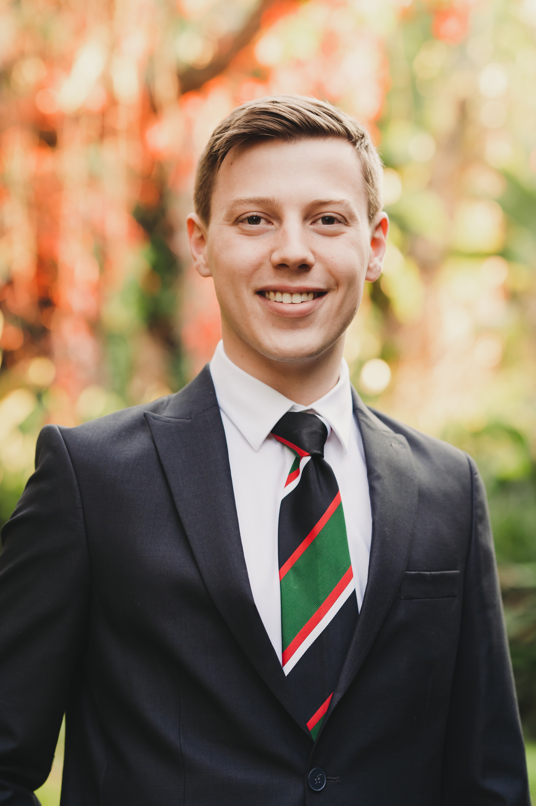

## About Me

::: {.home-intro}
::: {.profile-column}

:::
::: {.intro-column}
I am Alexander van Twisk, a final-year MSc Biostatistics student at Stellenbosch University. This portfolio documents my learning journey through the Biostatistical Consulting & Collaboration module, the penultimate module of my 2-year degree.

The purpose of this module, and the degree as a whole, is to build theoretical foundations with practical, hands-on experience. The BC module specifically focussed the development of collaborative abilities in research environments, communication skills, and professional consulting practices—competencies essential for effective biostatistical work in clinical settings.
:::
:::

**Internship Details:**

- **Organization**: Scigenix Pty (Ltd)
- **Location**: Pretoria, South Africa
- **Duration**: 23 June 2025 - 30 September 2025 (3 months)
- **Supervisor**: Dr Xan Swart

## Module Purpose

The Biostatistical Consulting module is designed to merge theoretical concepts with practical implementation, placing particular importance on developing collaborative abilities through interactive lectures with world renowned guest speakers,and experiential learning opportunities either through roll playing or a 3-month internship period. Unlike conventional lecture-based modules, the BC module emphasizes:

- **Discussion and questioning** to develop critical thinking
- **Practical collaboration skills** essential for effective biostatistical consulting
- **Reflection on professional practice** to foster continuous growth
- **Real-world application** of statistical methods in clinical research

This portfolio serves as evidence of my learning, growth, and professional development throughout the module and internship experience.

## Portfolio At a Glance

### [Internship Report](internship/index.qmd)

A comprehensive account of my 3-month internship at Scigenix, including:

- [Introduction & Background](internship/introduction.qmd) - Overview of Scigenix and my role
- [Learning Objectives](internship/learning-objectives.qmd) - How I met module outcomes
- [Relation to Coursework](internship/relation-to-coursework.qmd) - Connecting theory to practice
- [Work Outputs](internship/work-outputs.qmd) - Detailed project descriptions
- [Reflection](internship/reflection.qmd) - What I learned and how I grew

### [Module Reflections](reflections/index.qmd)

Daily reflections following the Gibbs Reflective Cycle across two weeks of intensive module sessions:

- **Week 1 (Block 2)**: 4 days (April 14-17, 2025) covering professional conduct, scientific writing, collaboration skills, and leadership
- **Week 2 (Block 1)**: 3 days (May 19-21, 2025) focusing on the ASCCR framework, POWER structure, and practice consultations

Each reflection critically examines my learning experiences, connecting them to professional development as a biostatistician.

<!--
### [Learning Outcomes](learning-outcomes/index.qmd)

Information on how I achieved the module's learning outcomes through specific activities and experiences.

### [Coursework](coursework/index.qmd)

Overview of how the module integrates with my broader MSc Biostatistics curriculum.
-->

### [Artefacts](artefacts/index.qmd)

Repository of evidence supporting my reflections and demonstrating my learning.