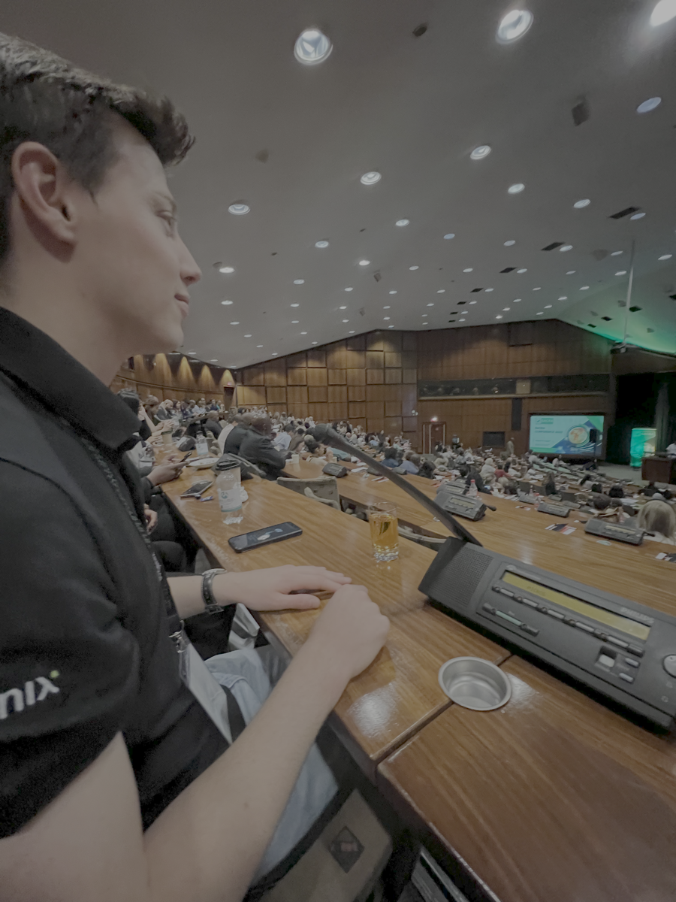
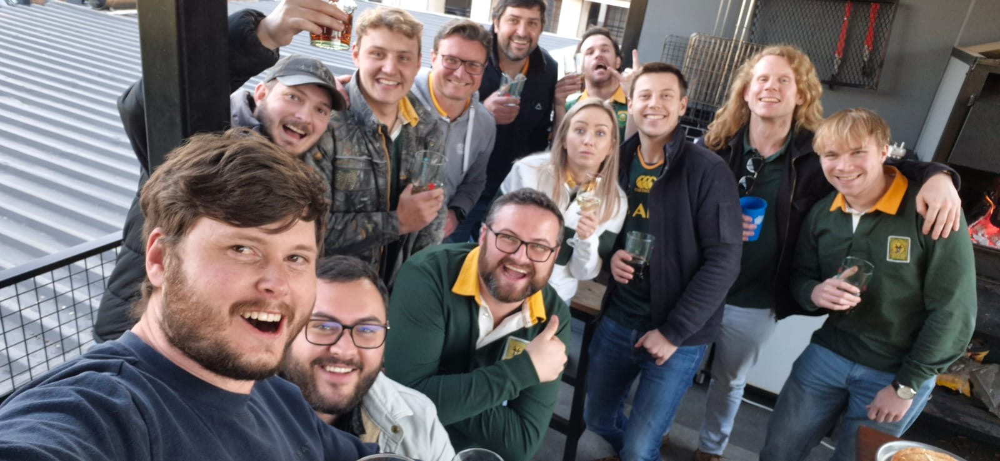
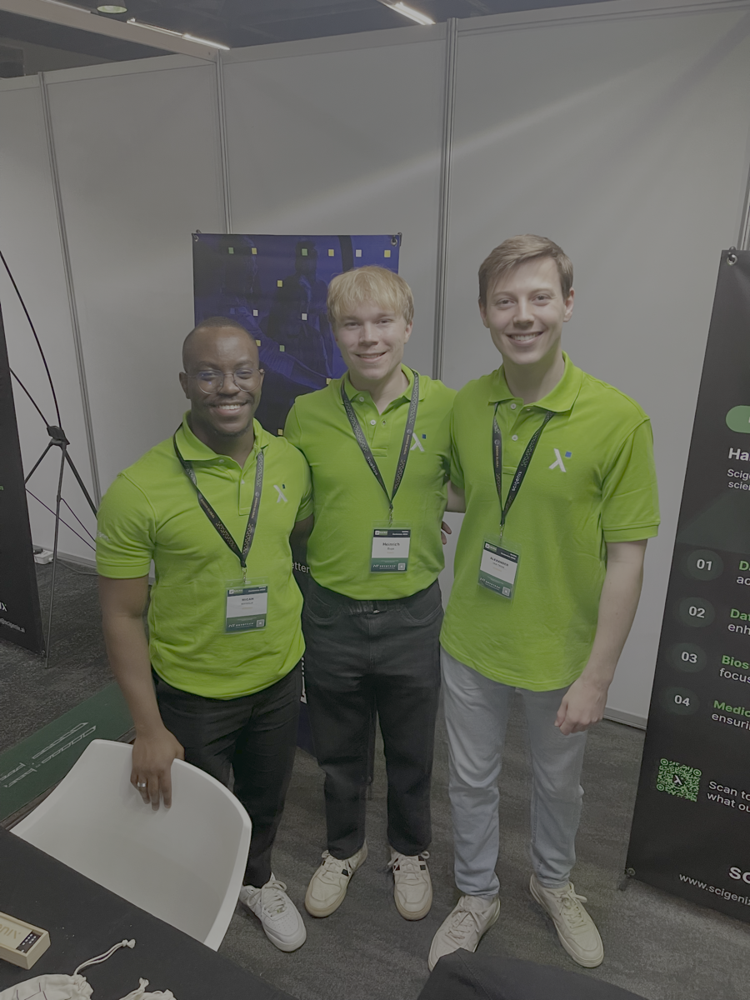

---
format:
  pdf:
    documentclass: article
    papersize: a4
    geometry:
      - top=2.5cm
      - bottom=2.5cm
      - left=2.5cm
      - right=2.5cm
    fontsize: 11pt
    mainfont: Arial
    sansfont: Arial
    monofont: Courier New
    include-in-header:
      text: |
        \usepackage{fontspec}
        \setmainfont{Arial}
        \usepackage{array}
        \usepackage{longtable}
        \usepackage{booktabs}
        \usepackage{caption}
        \usepackage{etoolbox}
        \AtBeginEnvironment{longtable}{\small}
        \AtBeginEnvironment{tabular}{\small}
        \usepackage{fancyhdr}
        \pagestyle{fancy}
        \fancyhead[L]{Internship Report}
        \fancyhead[R]{Alexander van Twisk}
        \fancyfoot[C]{\thepage}
        \widowpenalty=10000
        \clubpenalty=10000
    toc: false
    number-sections: true
    fig-cap-location: bottom
    colorlinks: true
    linkcolor: blue
    pdf-engine: xelatex
editor: source
---

\begin{titlepage}
\centering
\vspace*{2cm}

{\Huge\bfseries Internship Report\\}
\vspace{0.5cm}
{\Large Biostatistical Consulting \& Collaboration Module\\}
\vspace{2cm}

{\Large\textbf{Alexander van Twisk}\\}
\vspace{0.5cm}
{\large MSc Biostatistics\\}
{\large Stellenbosch University\\}
\vspace{2cm}

{\large\textbf{Internship Details}\\}
\vspace{0.5cm}
\begin{tabular}{rl}
\textbf{Organisation:} & Scigenix Pty (Ltd) \\
\textbf{Location:} & Pretoria, South Africa \\
\textbf{Duration:} & 23 June 2025 - 30 September 2025 \\
\textbf{Supervisor:} & Dr Xan Swart \\
\end{tabular}

\vfill

{\large \today}
\end{titlepage}

\newpage

\tableofcontents

\newpage

# Introduction and Background

## About My Journey

I am a final year master's student at Stellenbosch University completing my MSc in Biostatistics. After foundational and advanced coursework in my first year, I progressed to the Biostatistical Consulting (BC) module, which merged theoretical concepts with practical implementation through interactive lectures and experiential learning.

I began my internship at Scigenix Pty (Ltd) on 23 June 2025, concluding on 30 September 2025. This three-month placement offered the opportunity to apply skills from both the BC module and my broader MSc training. Through this internship, I honed my ability to communicate complex statistical concepts to non-specialist audiences, a skill I now regard as essential for successful collaboration in clinical research.

{width=200pt fig-align="center"}

## Background of Organisation

Scigenix is a dynamic clinical research organisation specializing in data-driven solutions for pharmaceutical and healthcare sectors, with particular focus on clinical trials. With a global team, the company leverages open-source technologies (R rather than SAS) to deliver cost-effective, scalable solutions across clinical research, from study design to regulatory submission.

The organization addresses challenges in data collection, cleaning, analysis, and reporting under strict regulatory constraints. Scigenix offers streamlined, AI-supported pipelines supporting faster decision-making, defined by values including scientific excellence, attention to detail, collaboration, and supportive work environment.

In the biostatistics unit, R is the primary programming language. Each project is structured as a self-contained R package, standardizing workflows and ensuring reproducibility. I observed exponential improvement in my programming abilities as I was exposed to best practices in R, version control using Git, and collaborative development workflows.

{width=200pt fig-align="center"}

## Life at Scigenix

The Scigenix office is based in Hazelwood, Pretoria, with flexible working hours (7-8am start) and work-from-home options. Office culture is highly valued, with regular Friday social gatherings including braais and takeaway lunches. The leadership played an integral role in helping me feel welcome from day one, creating a supportive environment that motivated me to contribute my best work.

{width=220pt fig-align="center"}

## My Role and Responsibilities

Throughout my internship, my primary responsibilities centered on statistical consulting and collaboration with researchers, as well as supporting various aspects of clinical trial conduct.

My role encompassed:

- **Statistical Consulting**: Providing expert statistical support for clinical research projects
- **Data Analysis**: Conducting comprehensive analyses using advanced statistical methods
- **Quality Control**: Implementing rigorous QC processes to ensure data integrity
- **Clinical Trial Support**: Contributing to randomisation, data safety monitoring, and regulatory compliance
- **Software Development**: Creating tools to streamline data validation and analysis workflows
- **Communication**: Translating complex statistical concepts for non-statistical stakeholders

The internship provided a holistic view of the biostatistician's role in clinical research, from initial study design through to final reporting and regulatory submission.

\newpage

# Learning Objectives

This section demonstrates how I achieved the learning outcomes of the Biostatistical Consulting & Collaboration module through specific internship activities and tasks at Scigenix.

## Matrix of Learning Outcomes and Tasks

The table below maps specific learning outcomes to the various projects and activities I undertook during my internship, identifying the two most relevant modules for each activity and providing a brief explanation of relevancy.

| Activity/Task | Two Most Relevant Modules | Brief Explanation of Relevancy |
|:-------------|:-------------------------|:-------------------------------|
| Job Satisfaction Survey | • Biostatistical Consulting • Categorical Data Analysis & GLMs | Led full consultation project applying ordinal logistic regression for Likert-scale data and communicating findings to clinical team |
| Heart Murmurs Study | • Biostatistical Consulting • Categorical Data Analysis & GLMs | Conducted logistic regression analysis and created stakeholder-friendly reports for educational research question |
| Fresh Gas Flow Analysis | • Data Management & Statistical Computing • Linear Models | Complex data restructuring with hour/case-level data and applied GLMs for clustered observations |
| Randomisation | • Design and Analysis of Clinical Trials • Principles of Statistical Inference | Implemented randomisation schedules for RCTs including mock validation and final allocation sequences with proper power considerations |
| Data Safety Committee | • Design and Analysis of Clinical Trials • Fundamentals of Epidemiology | Observed DSC meeting procedures and completed GCP training, understanding ethical oversight and Declaration of Helsinki in practice |
| Quality Control | • Data Management & Statistical Computing • Biostatistical Consulting | Implemented peer review processes and regulatory compliance checks for trial outputs, ensuring reproducibility |
| Annotated CRFs | • Data Management & Statistical Computing • Design and Analysis of Clinical Trials | Mapped clinical data to CDISC SDTM domains, learning regulatory data standards essential for trial submissions |
| Manual Edit Checks | • Data Management & Statistical Computing • Design and Analysis of Clinical Trials | Developed 134 automated validation rules in R for clinical trial data quality assurance and regulatory compliance |
| Shiny App Development | • Data Management & Statistical Computing • Categorical Data Analysis & GLMs | Created production-grade tool for dataset comparison and MedDRA coding validation using {golem} framework and modern R packages |

The internship demonstrated how interconnected these learning outcomes are in practice. A single project often required simultaneously applying multiple skills, from study design and data management to analysis, communication, and collaboration. The most important lesson I learned is that technical statistical expertise must be paired with strong soft skills. The ability to communicate clearly, collaborate effectively, and manage projects efficiently is what transforms a statistician into an effective biostatistical consultant.

\newpage

# Relation to Coursework

This section demonstrates how my consulting and clinical research work at Scigenix related to specific courses in the MSc Biostatistics programme.

## Matrix of Tasks and Related Modules

| Task in Cases | Relevant Modules | Relevance |
|:-------------|:----------------|:----------|
| Sample size determination | • Principles of Statistical Inference • Design and Analysis of Clinical Trials | Applied mock power calculations and sample size determination for RCT randomisation, understanding Type I/II errors and their practical implications |
| Statistical Analysis Plan | • Biostatistical Consulting • Design and Analysis of Clinical Trials | Developed comprehensive analysis plans specifying primary/secondary outcomes, statistical methods, and handling of missing data for consultation projects |
| Formulating Research Questions | • Fundamentals of Epidemiology • Biostatistical Consulting | Translated clinical problems into testable hypotheses, ensuring questions were specific, measurable, and aligned with available data |
| Questionnaire design | • Fundamentals of Epidemiology • Data Management & Statistical Computing | Worked with MSQ satisfaction scales and MurmurQuiz design, understanding Likert scales, response bias, and validation measures |
| Formulating Study designs | • Fundamentals of Epidemiology • Design and Analysis of Clinical Trials | Contributed to RCT design through randomisation schedules, understood cross-sectional and observational study limitations |
| Communication – oral and written | • Biostatistical Consulting | Presented findings to multidisciplinary teams, wrote analysis reports translating complex statistics for clinical audiences |
| Research Ethics | • Fundamentals of Epidemiology • Design and Analysis of Clinical Trials | Participated in Data Safety Committee, completed GCP training, understood Declaration of Helsinki principles in practice |
| Data management | • Data Management & Statistical Computing | Extensive data cleaning in R, managed complex datasets with hour-level and case-level data, created reproducible workflows |
| Quality control | • Data Management & Statistical Computing • Biostatistical Consulting | Implemented peer review processes, used Excel checklists for QC, ensured regulatory compliance in all outputs |
| Advanced statistical programming | • Data Management & Statistical Computing • Linear Models • Categorical Data Analysis & GLMs | Developed R packages for analyses, created automated reporting systems, implemented complex data transformations and modelling |

## Detailed Module Connections

### Biostatistical Consulting

The most directly relevant module to my internship. The ASCCR framework, LISA Collaborative Attitude, and POWER structure for collaboration meetings were tools I used regularly. The mock consultations prepared me well for real client interactions, though actual consultations require even more flexibility and patience.

### Design and Analysis of Clinical Trials

This module provided the theoretical framework for understanding randomized controlled trials. My work on randomisation schedules and participation in Data Safety Committee meetings brought these concepts to life, showing me the real-world complexities of implementing theoretically sound trial designs.

### Data Management & Statistical Computing

This module's emphasis on reproducible research, version control, and good programming practices directly influenced how I structured my work at Scigenix. Every project was developed as a self-contained R package, ensuring transparency and reproducibility.

## From Theory to Practice: Key Insights

### The Gap Between Clean Textbook Data and Real-World Messiness

My coursework typically provided clean, well-structured datasets designed to teach specific statistical concepts. The internship exposed me to the reality of incomplete data, inconsistent coding, and variables that don't behave as expected. Data cleaning often took 50-70% of project time, a reality not always emphasized in coursework.

### Statistical Significance vs. Clinical Relevance

Theoretical modules teach us to focus on p-values and confidence intervals. Clinical collaborations taught me that statistical significance means little if the effect size isn't clinically meaningful. Learning to have these conversations with clinicians was one of the most valuable skills I developed.

### The Importance of Communication

Technical skills from my modules were necessary but not sufficient. The ability to explain complex statistical concepts in plain language, to listen carefully to collaborators' concerns, and to ask clarifying questions proved just as important as knowing which test to run.

### Reproducibility in Practice

While coursework emphasized reproducibility in principle, the internship showed me what it means in practice: version-controlled code, comprehensive documentation, validation scripts, and standardized workflows. The R package structure used at Scigenix ensured that analyses could be reproduced months or years later, a critical requirement for regulatory submissions.

## Key Takeaway

The internship demonstrated that the MSc Biostatistics curriculum provides an excellent theoretical foundation, but real-world consulting requires integrating knowledge across modules while developing soft skills like communication, project management, and collaboration. The greatest value came from applying multiple modules' concepts simultaneously to solve complex, messy real-world problems.

\newpage

# Work Outputs

During my internship at Scigenix, I contributed to a diverse range of projects spanning statistical consultation, clinical trial support, and software development. This section provides detailed descriptions of each project, highlighting my specific contributions and the skills I developed.

## Consultation Projects

### Job Satisfaction Survey Analysis

**Project Overview**

One of the main statistical consulting projects I worked on during my internship involved analysing a job satisfaction survey among anaesthesia consultants and registrars in South Africa. The purpose of the study was to assess key domains of job satisfaction using the Minnesota Satisfaction Questionnaire (MSQ). We also wanted to explore how satisfaction, demographic variables, and respondents' intention to leave their current post were associated.

**My Responsibilities**

- **Data Management**: Imported and cleaned over sixty variables from raw Excel data, managing Likert-scale responses and missing values
- **Psychometric Assessment**: Implemented MSQ scoring framework, assessed internal consistency using Cronbach's alpha, and conducted exploratory factor analysis
- **Statistical Analysis**: Applied ordinal logistic regression to model intention to leave as a function of demographic predictors
- **Reporting**: Produced publication-quality tables and visualizations including Likert plots and boxplots

**Key Challenges and Learning**

Interpreting ordinal logistic regression results in understandable language proved challenging. My supervisor encouraged me to make findings accessible to clinicians, teaching me that "the job is not complete until you can make it understandable." The consultation meeting revealed that much time is spent refining report details (graph formatting, plot selection) to ensure clarity for journal submission, an important lesson about multidisciplinary collaboration.

### Can Anaesthesiology Trainees Distinguish Between Different Heart Murmurs?

**Project Overview**

This cross-sectional study investigated whether anaesthesiology trainees could distinguish between benign and pathologic paediatric heart murmurs using pre-recorded audio clips. The project addressed the ability of anaesthetists to identify pathologic murmurs during pre-operative assessments, which directly affects patient safety and theatre efficiency. Participants completed a 20-question online test (MurmurQuiz) and provided background information relating to their clinical experience.

**My Responsibilities**

Developed modular R codebase processing quiz and survey data, conducted univariate and multivariable logistic regression analyses, and created stakeholder-friendly reports using the `gtsummary` package.

**Personal Significance**

This educational research project focused on trainees' ability to perform routine yet critical tasks. Working on paediatric patient safety gave me satisfaction knowing the work could have real-world impact on quality of care for vulnerable patients.

### Analysis of Fresh Gas Flow Rates

**Project Overview**

The "Analysis of Fresh Gas Flow Rates and its Effect on Consumption and Cost of Inhalational Anaesthetic Agents in a Tertiary Academic Hospital in Pretoria" was both one of the most challenging and impactful projects of my internship. Motivated by the growing recognition of climate change and healthcare's responsibility to address its environmental footprint, this study aimed to examine current anaesthetic practices, specifically the use of volatile inhalational agents and nitrous oxide, both notable greenhouse gases.

**Data Challenges and Approach**

The raw dataset had information at case-level and hour-level, requiring creation of two separate datasets. A particular challenge was parsing clinician names stored in single cells separated by commas. I wrote R scripts to split and restructure this data. The analysis applied generalized linear models to account for clinicians working on multiple cases.

**Impact**

By identifying patterns in anaesthetic agent usage and costs, the findings offer actionable insights to reduce the hospital's carbon footprint and promote environmentally responsible healthcare practices. This project emphasized the importance of well-structured data cleaning and reproducible code for complex analyses.

## Clinical Research and Related Work

### Randomisation

Preparing randomisation schedules for RCTs marked my first concrete contribution to a clinical trial. The process involved two stages: mock randomisation (using fixed seed for validation) and final randomisation (using randomly selected seed for actual allocation). This two-stage approach ensured both reproducibility for quality control and true randomness for the trial. I gained understanding of different methods (simple, blocked, stratified) and appreciation for the rigour required in clinical trials.

### Data Safety Committee

Attending a Data Safety Review Committee meeting was a key goal of my internship. Scigenix demonstrated deep commitment to patient wellbeing, enrolling all staff in intensive Good Clinical Practice (GCP) training. The confidential DSC meeting showed zero tolerance for anything risking participant safety, with decisions made formally through voting. This reinforced my understanding that ethical research practices are fundamental to the entire research process and highlighted the biostatistician's ethical responsibilities.

### Quality Control

We employed structured quality control using comprehensive Excel checklists for line-by-line peer review. Each item targeted specific quality aspects: correct statistical methods, alignment between R outputs and Word presentation, and template compliance. No detail was too minor: stylistic consistency in decimal points, abbreviations, font sizing, figure readability, and even colour schemes were meticulously checked. This process highlighted that producing statistically valid results is only part of the job; communicating them clearly and accurately is equally critical.

### Annotated Case Report Forms

Working on annotated CRFs involved mapping patient data collection forms to CDISC SDTM standards. The task required deciding which standardized "domain" each variable belonged to, a process more complex than it initially appeared. What seemed obvious often wasn't; domain classification depended on when data was collected and how it related to the study. This work illuminated the infrastructure supporting clinical research and the enormous effort required to ensure data can be collected, organized, and submitted for regulatory review.

### Manual Edit Checks

The Manual Edit Check (MEC) process encompassed 134 unique validation rules categorized as Clinical (CLIN) checks for clinical logic and Listing (LIS) checks for data completeness. I implemented the R-based validation framework, translating each rule into functions returning PASS, FAIL, or REVIEW results. The most challenging aspect was Inclusion/Exclusion criteria checks requiring sophisticated logic for medical events, and cross-form validation integrating data from multiple CRF domains. This work revealed the enormous effort needed to ensure data can be trusted for regulatory submissions, an aspect of biostatistical work that receives little academic attention but proves essential in practice.

### Shiny App Development

I developed a production-grade Shiny application for comparing clinical trial datasets and validating medical coding compliance. The application had two modules: Dataset Comparison (using Arsenal's comparedf() function to identify discrepancies) and Coding Checks (validating medical terminology across Adverse Events, Medical History, and Concomitant Medications against current MedDRA standards).

I used the {golem} framework to structure the application with modular architecture for production readiness. The coding module required interfacing with multiple MedDRA versions and WHO Drug dictionaries on SharePoint. This project synthesized my MSc knowledge while exposing me to clinical research processes, medical coding standards, and enterprise software development practices. The application will save several hours per study in data validation and reduce error rates, demonstrating how biostatisticians can multiply their impact beyond traditional analysis roles.

\newpage

# Reflection

## Introduction

Looking back on my three-month internship at Scigenix, I can see how transformative this experience has been for my professional development as a biostatistician. This reflection addresses what I learned, why this learning was significant, what I would have done differently, and the challenges I encountered along the way.

{width=200pt fig-align="center"}

## What Did I Learn?

### Technical Skills

**Advanced Data Management**: The internship taught me that data cleaning is often 50-70% of the work. I learned to handle complex data structures (hour-level vs. case-level data), parse messy text fields, and create reproducible pipelines.

**Production-Grade Programming**: The internship introduced me to software engineering principles for biostatistics. The {golem} framework for Shiny development, R package structures, and rigorous version control at Scigenix showed me how to write code others can trust and maintain.

**Regulatory Standards**: CDISC standards, MedDRA coding, and ICH guidelines, barely mentioned in coursework, proved essential for clinical trial work. Working on CRFs and coding compliance gave me practical insight into how these standards protect patient safety.

### Soft Skills

**Communication**: I learned that explaining statistical concepts clearly is as important as choosing the right method. The job satisfaction project taught me "the job is not complete until you can make it understandable."

**Project Management**: Managing multiple projects simultaneously, setting goals, and coordinating with stakeholders taught me to balance perfectionism with pragmatism, knowing when to refine analysis and when good enough is sufficient.

**Collaboration**: Clinical research requires constant collaboration with clinicians, data managers, and regulatory specialists. I learned to listen, ask clarifying questions, and appreciate that statistical expertise is one piece of the puzzle.

**Resilience**: Data doesn't always behave as expected. I learned to view setbacks as learning opportunities and maintain professional composure.

## Why Was This Learning Significant?

### Bridging the Theory-Practice Gap

My MSc coursework provided an excellent theoretical foundation, but the internship showed me how to apply that knowledge in messy, real-world situations. Understanding the difference between statistical significance and clinical relevance, between a perfect analysis and a timely one, between what the textbook says and what actually works: these insights are what transform a student into a practitioner.

### Understanding the Bigger Picture

Before the internship, I thought about statistics in isolation: choose a test, run it, interpret the results. Now I understand that statistical analysis sits within a complex ecosystem: research ethics, regulatory requirements, patient safety, budget constraints, timeline pressures, and organizational politics. Seeing this broader context has made me a more thoughtful and effective biostatistician.

### Career Direction

The internship confirmed that I want to pursue a career in clinical research biostatistics. Seeing the tangible impact of statistical work on patient care, whether through the heart murmur study potentially improving pre-operative assessments or the fresh gas flow analysis contributing to environmental responsibility, gave me a sense of purpose that theoretical coursework couldn't provide.

### Professional Identity

I entered the internship as a student learning biostatistics. I'm leaving as a biostatistician who happens to still be completing formal studies. This shift in identity, from student to professional, may sound subtle, but it has profoundly affected how I approach problems, communicate with colleagues, and think about my career.

## What Would I Have Done Differently?

### Earlier Engagement with Medical Terminology

Looking back, I wish I had spent time before the internship familiarizing myself with basic medical terminology and clinical concepts. While I picked up necessary terms quickly during projects, having this foundation from the start would have made initial discussions more efficient and reduced the cognitive load when learning new statistical methods simultaneously.

### More Proactive Questions

In the early weeks, I sometimes hesitated to ask questions for fear of appearing incompetent. I now realize that asking clarifying questions early saves time later and demonstrates professional maturity rather than weakness. If I could do it again, I would be more proactive in seeking clarification when project requirements were ambiguous.

### Systematic Documentation from Day One

While I maintained good documentation throughout the internship, I wish I had been even more systematic from the beginning. Keeping a daily log of what I learned, challenges I faced, and solutions I discovered would have made this reflection easier to write and would provide valuable reference material for future projects.

### Time Management for Reflective Practice

The intensity of project work sometimes meant that reflection happened only when required. Building in regular time for reflection, perhaps 30 minutes every Friday afternoon, would have deepened my learning in real-time rather than retrospectively.

## Challenges Encountered and How I Handled Them

### Challenge 1: Imposter Syndrome

**The Challenge**: Especially in the first month, I felt overwhelmed by how much I didn't know. Experienced colleagues seemed to navigate complex regulatory requirements and statistical challenges effortlessly, while I struggled with basic concepts like CDISC domains.

**How I Handled It**: I reminded myself that comparing my beginning to their middle wasn't fair. I focused on daily progress rather than absolute expertise. I also found that being honest about what I didn't know, rather than pretending, actually built trust with colleagues who appreciated my willingness to learn.

**What I Learned**: Everyone was once a beginner. Expertise comes from experience, not from innate talent. Being comfortable with not knowing everything is actually a sign of professional maturity.

### Challenge 2: Technical Obstacles with Real Consequences

**The Challenge**: When working on the manual edit checks, I encountered validation rules that seemed to produce false positives. Unlike coursework where errors are academic, these errors could delay a clinical trial or, worse, allow invalid data to proceed.

**How I Handled It**: Rather than assuming my code was correct, I systematically tested edge cases, consulted documentation, and when still uncertain, brought specific examples to senior colleagues for review. I learned to value thoroughness over speed.

**What I Learned**: In clinical research, being approximately right is not good enough. The stakes (patient safety, regulatory compliance, company reputation) demand precision. This isn't perfectionism; it's professionalism.

### Challenge 3: The Pace of Industry vs. Academia

**The Challenge**: I was accustomed to academic timelines where thorough exploration of methods is valued. At Scigenix, project timelines were often tight, and "good enough" sometimes had to suffice when "perfect" wasn't feasible.

**How I Handled It**: I learned to prioritize which aspects of an analysis were critical to get exactly right (e.g., primary outcomes, regulatory requirements) versus which were less critical (e.g., exploratory subgroup analyses). I also got better at scoping projects realistically upfront.

**What I Learned**: Perfect is the enemy of good. In industry, delivering a solid analysis on time is more valuable than delivering a perfect analysis too late. This doesn't mean compromising on quality for core analyses, but it does mean being strategic about where to invest effort.

## Overall Reflections

### The Most Important Lesson

If I had to distill the internship into one lesson, it would be this: **Biostatistics is fundamentally a people discipline, not just a technical discipline.** The statistical methods matter, of course, but success depends on understanding what collaborators need, communicating clearly, managing expectations, and building trust. The best analysis in the world is worthless if you can't explain it in a way that enables decision-making.

### Gratitude

I am deeply grateful to Scigenix for taking a chance on a student with limited practical experience. The supportive culture, excellent mentorship from Dr. Swart and other colleagues, and the diversity of projects I was exposed to exceeded my expectations. The company's commitment to scientific excellence while maintaining a genuinely enjoyable work environment set a standard I will carry forward in my career.

### Looking Forward

As I complete my MSc and look toward my career, the internship has given me clarity about what I want from professional life:

- Work that has tangible impact on patient care and public health
- Collaborative environments where statistical expertise is valued and integrated into decision-making
- Opportunities for continuous learning and technical growth
- Organizations that balance scientific rigor with supportive culture

I'm excited to take the skills, knowledge, and professional identity I've developed at Scigenix into the next chapter of my career.